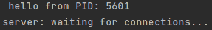
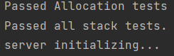
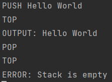

# Threads

ID: 209011840 ID: 206795841

This project represent a shared Stack/Queue using multi-threaded system
over Server/Client .

Here is the instruction of how to use:

- Before you start

    make all
    ./server
    ./client localhost

The main goal is to understand how the OS implements malloc and free on multi-threaded system and how we implement mutexes.

### Implement a multi-threaded lock free stack using POSIX methods

PUSH will push <text> into the stack.

POP will pop text from the stack.

TOP will display (output) the stack top.

EXIT kill this dialog with the server.

### Implement a multi-threaded lock free queue using POSIX methods

ENQUEUE <text>\n: insert to the tail. (Otherwise same as PUSH)

DEQUEUE\n: remove the tail. (Otherwise same as POP)

PEEK will display (output) the queue top.

EXIT kill this dialog with the server.

### Server
Server, run several tests to check allocation and server-stack communication. 
open socket and listen for up to 10 client (multi-threads)
The server handles the client request for a stack / queue
Using mutex and conditions in order to synchronize between the clients.

### client
Client, send commands to the server to manipulate the server stack / queue.

### Test
Test methods such as allocation correctness, manipulations on shared stack (push, pop, top, size).

### Malloc/Free
- Malloc, malloc func is implemented by sbrk() method.
- Free, free func is simply updating our memory management structure, to free the used blocks.

### how to use :
 - Open terminal for the server and run it with ./server.
 - Open few more terminals for client ./client localhost.
 - in the client terminal write the command in uppercase and wait for the server response.

